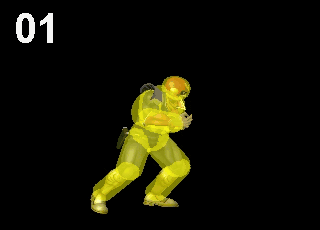

  <!-- Navigation Bar -->
  <nav>
    <ul>
      <li><a href="index">Home</a></li>
      <li><a href="personal_accomplishments">Accomplishments</a></li>
      <li><a href="previous_projects">Previous Projects</a></li>
      <li><a href="current_projects">Current Projects</a></li>
    </ul>
  </nav>
   

### Personal Accomplishments
---
#### Montana "Smash Brothers: Melee" Power Ranking (2019-2023)

Top Performances: 
<a href="https://www.ssbwiki.com/Montana_Power_Rankings" >Montana Power Rankings</a>
: (2022) - <b>3rd</b>, 2021 - <b>7th</b>
  
<a href="https://www.start.gg/tournament/fall-brawl-2023/events/melee-singles/brackets/1496188/2257612/standings" >Fall Brawl 2023</a>
: <b>8th</b> in singles, <b>3rd</b> in doubles
<a href="https://www.youtube.com/watch?v=1wN3INZSOkk&">Turtle Tuesday - David's Birthday Bash</a>
: <b>1st</b>
 
<a href="https://www.youtube.com/watch?v=9cbKVsoK1B8&t=18650s">The Sweatshop 28</a>
: my first <b>1st</b> place in 2022
 
After watching a documentary about the early history of Super Smash Bros. Melee in late 2017, I decided to give the game a try. At first, I spent months practicing alone, driven by curiosity to see how far I could push myself. But when I finally reached out to the local Montana scene, I quickly realized that my practice was inadequate. I learned that growth in Melee wasn’t just individual — it was about learning and growing <i>with</i> others. Over the years, the community that whooped me has become more than rivals; they’ve become my friends, my support system, and the people whom have grown with me in a shared bond, both in-game and in life. I take pride in being ranked on the Montana PR: it is an achievement I will cherish forever, but I find myself cherishing moreso the personal growth and friendships I’ve gained along the way.

#### Top 500 America "Diablo 3" seasonal rift ranking (2020)

#### Top 10 Global "Angry Angry Templar" ranking (2016)
#### Top 09 parents' children ╰( ͡° ͜ʖ ͡° )つ──☆*:・
#### Top 03 University of Montana students named "Jacob D. Olson"